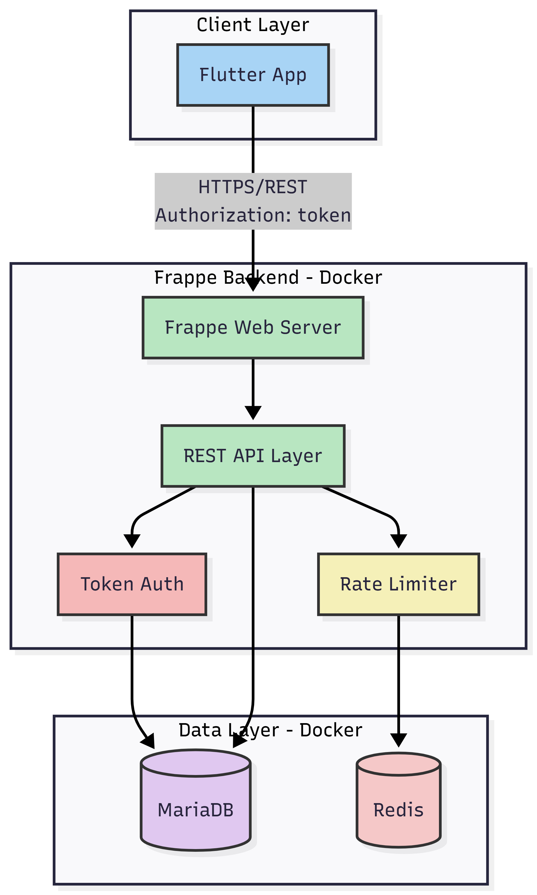
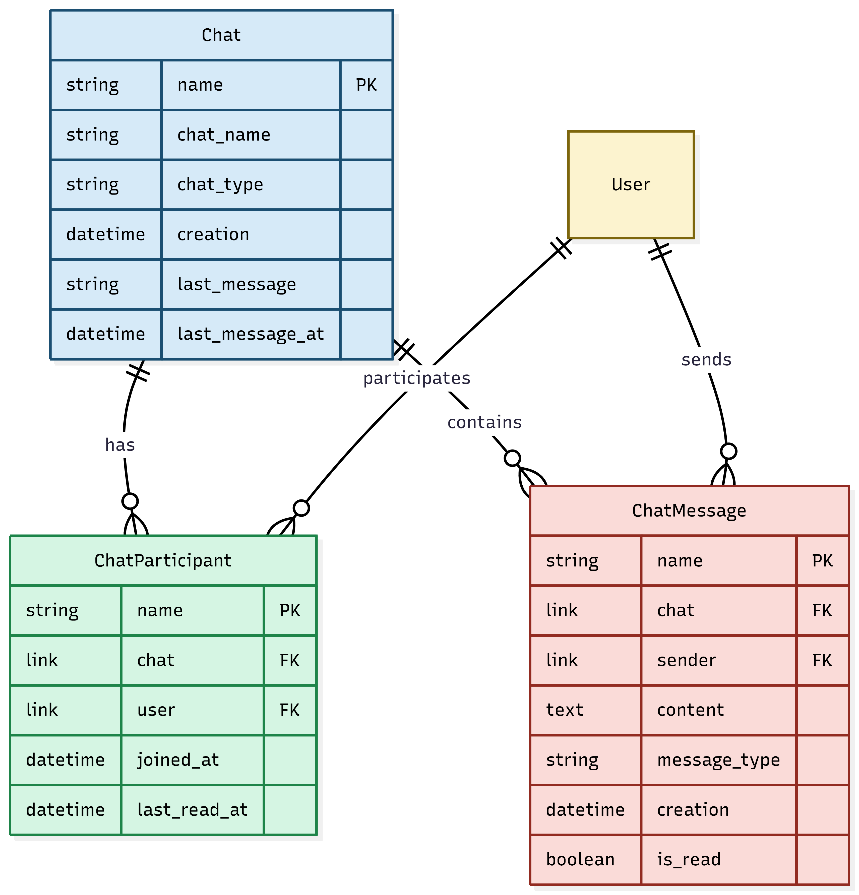
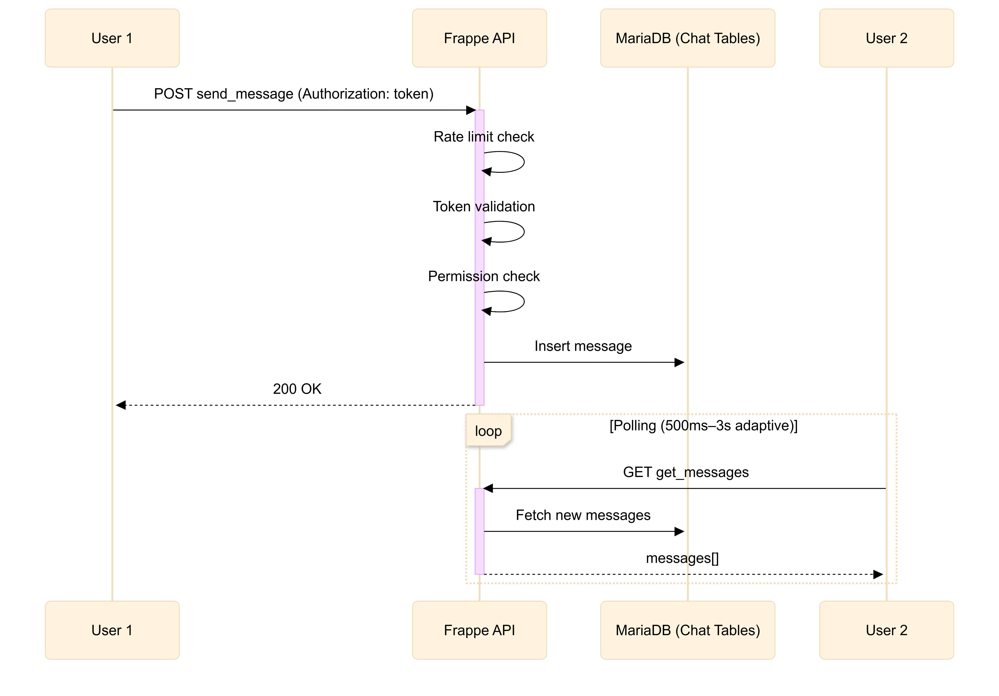
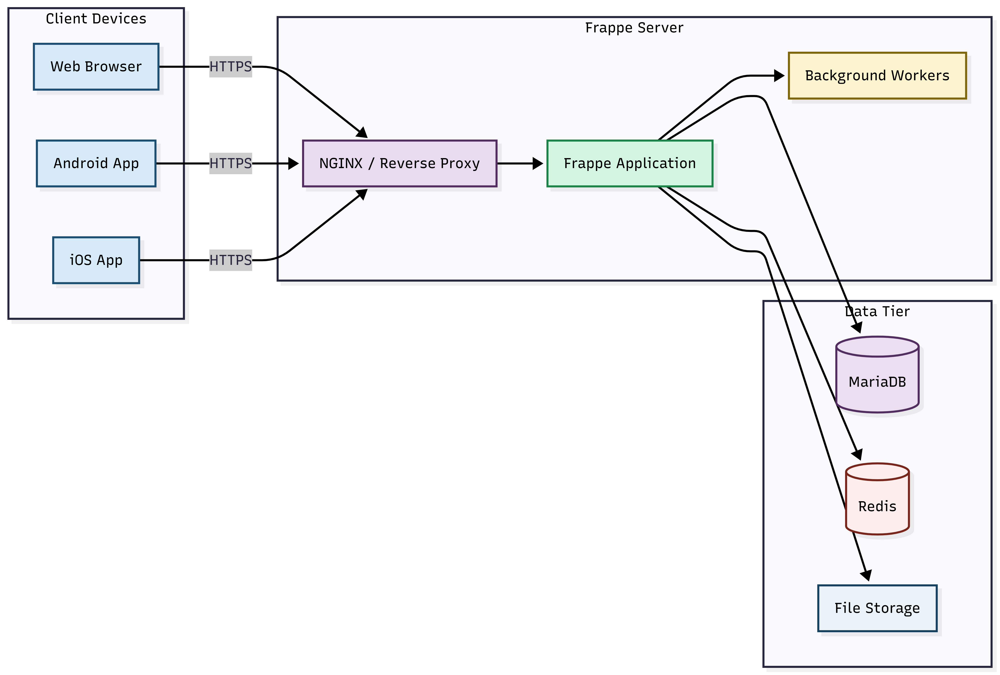

# Architecture

## System Overview

## Data Model

## Message Flow

## Deployment Architecture

## Authentication

Token-based using Frappe's native `api_key` and `api_secret` fields on User DocType.

**Flow:**
1. Login via `POST /api/method/frappe_chat.api.login`
2. Frappe `LoginManager` validates credentials
3. API generates/retrieves tokens from User DocType
4. Returns `api_key` and `api_secret` to client
5. Client stores token in secure storage
6. All requests include `Authorization: token {key}:{secret}` header
7. Frappe validates token and sets `frappe.session.user`

**Authorization:**
- `validate_chat_access()` checks Chat Participant table
- Only participants can view/send messages
- `PermissionError` raised for unauthorized access

## Message Delivery

**Approach: HTTP Polling with Adaptive Intervals**

The client periodically requests new messages from the server. The polling interval adjusts based on activity:

| State | Interval | Trigger |
|-------|----------|---------|
| Active chat | 500ms | New message sent/received |
| Idle | 3000ms | No activity for 10+ seconds |
| Chat screen closed | Paused | User navigates away from chat screen |

**Implementation:**
- Client tracks `lastMessageTime` timestamp
- Each poll sends `after={timestamp}` parameter
- Server returns only messages newer than timestamp
- Reduces bandwidth and processing

**Why Polling Over WebSockets/SSE:**

| Factor | Polling | WebSockets | SSE |
|--------|---------|------------|-----|
| Frappe support | Native | Requires Socket.IO | Limited |
| Infrastructure | Standard HTTP | Additional server | Proxy config |
| Mobile battery | Controllable | Always-on connection | Always-on |
| Network reliability | Tolerant | Reconnection logic | Reconnection logic |
| Implementation | Simple | Complex | Moderate |

Polling provides sufficient real-time experience (sub-second delivery during active chat) without adding infrastructure complexity. The adaptive interval minimizes server load during idle periods.

## Rate Limiting

Redis-based sliding window using `frappe.cache()`. Configurable limits per endpoint:

| Endpoint | Limit |
|----------|-------|
| `login` | 10/min |
| `signup` | 5/min |
| `get_chats` | 100/min |
| `create_chat` | 50/min |
| `get_messages` | 200/min |
| `send_message` | 100/min |

Response headers: `X-RateLimit-Limit`, `X-RateLimit-Remaining`, `X-RateLimit-Reset`

## API Endpoints

| Endpoint | Method | Auth |
|----------|--------|------|
| `frappe_chat.api.login` | POST | No |
| `frappe_chat.api.signup` | POST | No |
| `frappe_chat.api.get_chats` | GET | Yes |
| `frappe_chat.api.create_chat` | POST | Yes |
| `frappe_chat.api.get_messages` | GET | Yes |
| `frappe_chat.api.send_message` | POST | Yes |
| `frappe_chat.api.mark_as_read` | POST | Yes |
| `frappe_chat.api.get_chat_participants` | GET | Yes |
| `frappe_chat.api.get_users` | GET | Yes |

## Design Decisions

**Token Authentication:** Cross-platform compatible (web, mobile) without cookie handling issues. Uses native Frappe fields (`api_key`, `api_secret`). Each request is stateless and self-contained.

**Chat Participant Child Table:** Enables efficient access control queries with a single lookup. Supports both direct (2 participants) and group chats.

**Polling Over Push:** Works within Frappe's HTTP-only architecture without additional dependencies like Socket.IO or Redis pub/sub.

## CORS Configuration

Configured in `hooks.py`:
- Development: `localhost:*`, `127.0.0.1:*`
- Production: via `PRODUCTION_ORIGIN` env var
